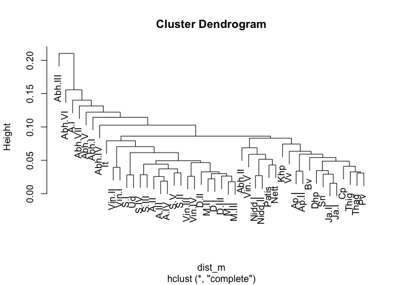
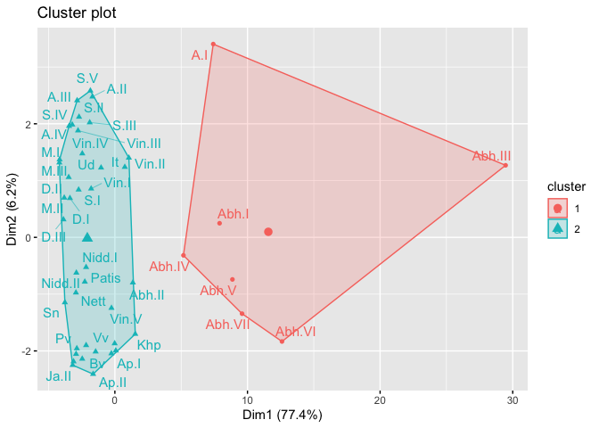
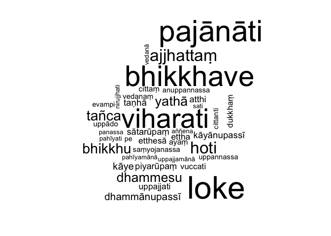

<!-- README.md is generated from README.Rmd. Please edit that file -->

# tipitaka

<!-- badges: start -->

<!-- badges: end -->

The goal of tipitaka is to allow students and researchers to apply the
tools of computational linguistics to the ancient Buddhist texts known
as the Tipitaka or Pali Canon.

The Tipitaka is the canonical scripture of Theravadin Buddhists
worldwide. It purports to record the direct teachings of the historical
Buddha. It was first recorded in written form in what is now Sri Lanka,
likely around 100 BCE.

The tipitaka package primarily consists of the texts of the Tipitaka in
various electronic forms, plus a few simple functions and data
structures for working with the Pali language.

The version of the Tipitaka included here is based on what’s known as
the Chattha Sangāyana Tipiṭaka version 4.0 (aka, CST4) published by the
Vipassana Research Institute and received from them in April 2020. I
have made a few edits to the CST4 files in creating this package:

  - Where volumes were split across multiple files, they are here are
    combined as a single volume

  - Where volume numbering was inconsistent with the widely-used Pali
    Text Society (PTS) scheme, I have tried to conform with PTS.

  - A very few typos that were found while processing have been
    corrected.

There is no universal script for Pali; traditionally each Buddhist
country ususes its own script to write Pali phonetically. This package
uses the Roman script and the diacritical system developed by the PTS.
However, note that the Pali alphabet does NOT follow the alphabetical
ordering of English or other Roman-script languages. For this reason,
tipitaka includes `pali_alphabet` giving the full Pali alphabet in
order, and the functions, `pali_lt`, `pali_gt`, `pali_eq`, and
`pali_sort` for comparing and sorting Pali strings.

## Installation

You can install the released version of tipitaka from
[CRAN](https://CRAN.R-project.org) with:

``` r
install.packages("tipitaka")
```

And the development version from [GitHub](https://github.com/) with:

``` r
# install.packages("devtools")
devtools::install_github("dangerzig/tipitaka")
```

## Example

You can use tipitaka to do clustering analysis of the various books of
the Pali Canon. For example:

``` r
library(tipitaka)
dist_m <- dist(tipitaka_wide)
cluster <- hclust(dist_m)
plot(cluster)
```



You can also create traditional k-means clusters and visualize these
using packages like `factoextra`:

``` r
library(factoextra) # great visualizer for clusters
km <- kmeans(dist_m, 2, nstart = 25, algorithm = "Lloyd")
fviz_cluster(km, dist_m, labelsize = 12, repel = TRUE)
```



You can also explore the topics of various parts of the Tipitaka using
packges like `wordcloud`:

``` r
library(wordcloud)
library(dplyr)
sati_sutta_long %>%
  anti_join(pali_stop_words, by = "word") %>%
  with(wordcloud(word, n, max.words = 40)) 
```



Finally, we can look at word frequency by rank:

``` r
library(dplyr, quietly = TRUE)
freq_by_rank <- tipitaka_long %>%
  group_by(word) %>%
  add_count(wt = n, name = "word_total") %>%
  ungroup() %>%
  distinct(word, .keep_all = TRUE) %>%
  mutate(tipitaka_total =  
           sum(distinct(tipitaka_long, book, 
                        .keep_all = TRUE)$total)) %>%
    transform(freq = word_total/tipitaka_total) %>%
  arrange(desc(freq)) %>%
  mutate(rank = row_number()) %>%
  select(-n, -total, -book)

freq_by_rank %>%
  ggplot(aes(rank, freq)) +
  geom_line(size = 1.1, alpha = 0.8, show.legend = FALSE) +
  scale_x_log10() +
  scale_y_log10()
```


